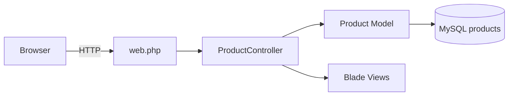

# Dokumentasi Proyek — InventarisKu

> **Modul terkait:** [09-proyek-mandiri.md](../09-proyek-mandiri.md)  
> **Penilaian:** [rubrik-penilaian.md](rubrik-penilaian.md)  
> **Lingkungan kerja:** Project Laravel mandiri di luar folder `starter/`

Dokumen ini mendefinisikan spesifikasi, kebutuhan, dan panduan implementasi **InventarisKu** — Sistem Manajemen Inventaris Lab Komputer Sekolah.

---

## 1. Ringkasan Proyek

| Item | Keterangan |
|------|------------|
| **Nama aplikasi** | InventarisKu |
| **Deskripsi** | Aplikasi web untuk pengelolaan data barang inventaris lab komputer sekolah |
| **Stack teknologi** | Laravel 13, MySQL, Blade, Tailwind CSS v4, Vite |
| **Entity utama** | `Product` |
| **Pengguna** | Petugas lab / admin inventaris |

### Ruang Lingkup

**Dalam lingkup proyek:**

- Operasi CRUD data barang (nama, spesifikasi, jumlah)
- Layout aplikasi dengan navigasi konsisten
- Validasi formulir dan notifikasi aksi
- Antarmuka berbasis Tailwind CSS

**Luar lingkup proyek:**

- Autentikasi dan manajemen pengguna
- Relasi antar entitas database
- Unggah gambar barang
- REST API dan aplikasi mobile

---

## 2. Analisa Kebutuhan

### 2.1 Latar Belakang

Pencatatan inventaris lab komputer sekolah yang masih dilakukan secara manual menimbulkan beberapa kendala operasional:

- Data barang tersebar di buku catatan atau spreadsheet
- Sulit mengetahui jumlah stok peralatan yang tersedia
- Risiko kehilangan atau kerusakan data inventaris
- Tidak adanya riwayat perubahan data yang terstruktur

### 2.2 Tujuan

Menyediakan sistem web terpusat bagi petugas lab untuk mengelola data inventaris barang secara digital melalui operasi tambah, lihat, ubah, dan hapus.

### 2.3 Aktor

| Aktor | Deskripsi |
|-------|-----------|
| **Petugas lab / admin inventaris** | Pengguna tunggal yang mengelola seluruh data barang. Versi ini tidak menyertakan mekanisme login. |

### 2.4 User Stories

| ID | User Story | Prioritas |
|----|-----------|-----------|
| US-01 | Sebagai petugas, saya ingin melihat daftar barang agar mengetahui inventaris yang tersedia | Tinggi |
| US-02 | Sebagai petugas, saya ingin menambah barang baru agar data inventaris tetap mutakhir | Tinggi |
| US-03 | Sebagai petugas, saya ingin mengubah data barang agar spesifikasi dan jumlah tetap akurat | Tinggi |
| US-04 | Sebagai petugas, saya ingin menghapus barang yang sudah tidak digunakan | Tinggi |
| US-05 | Sebagai petugas, saya ingin menerima notifikasi sukses atau error setelah setiap aksi | Tinggi |
| US-06 | Sebagai petugas, saya ingin mencari barang berdasarkan nama | Rendah |

### 2.5 Kebutuhan Fungsional

| No | Kebutuhan | User Story |
|----|-----------|------------|
| F-01 | Menampilkan tabel seluruh data barang | US-01 |
| F-02 | Formulir penambahan barang dengan penyimpanan ke database | US-02 |
| F-03 | Formulir pengubahan barang dengan pembaruan database | US-03 |
| F-04 | Penghapusan barang dengan dialog konfirmasi | US-04 |
| F-05 | Validasi input pada field nama, spesifikasi, dan jumlah | US-05 |
| F-06 | Notifikasi flash setelah operasi create, update, dan delete | US-05 |
| F-07 | Pencarian barang berdasarkan nama | US-06 |

### 2.6 Kebutuhan Non-Fungsional

| No | Kebutuhan |
|----|-----------|
| NF-01 | Kompatibel dengan browser modern (Chrome, Firefox, Edge) |
| NF-02 | Antarmuka responsif dan mudah dibaca |
| NF-03 | Persistensi data melalui MySQL |
| NF-04 | Arsitektur mengikuti konvensi Laravel yang diajarkan pada Modul 1–8 |

---

## 3. Spesifikasi Teknis

### 3.1 Entity

- **Model:** `Product`
- **Tabel:** `products`

### 3.2 Skema Database

| Kolom | Tipe Laravel | Keterangan |
|-------|--------------|------------|
| `id` | `id()` | Primary key, auto increment |
| `nama` | `string` | Nama barang |
| `spesifikasi` | `string` | Spesifikasi atau deskripsi teknis barang |
| `jumlah` | `unsignedInteger` | Jumlah unit tersedia |
| `created_at` | `timestamp` | Timestamp pembuatan record |
| `updated_at` | `timestamp` | Timestamp pembaruan record |

### 3.3 Contoh Migration

```php
Schema::create('products', function (Blueprint $table) {
    $table->id();
    $table->string('nama');
    $table->string('spesifikasi');
    $table->unsignedInteger('jumlah');
    $table->timestamps();
});
```

### 3.4 Aturan Validasi

Validasi diterapkan pada method `store` dan `update` di controller.

| Field | Aturan | Pesan error |
|-------|--------|-------------|
| `nama` | `required`, `string`, `max:255` | Nama barang wajib diisi |
| `spesifikasi` | `required`, `string`, `max:255` | Spesifikasi wajib diisi |
| `jumlah` | `required`, `integer`, `min:0` | Jumlah minimal 0 |

```php
$validated = $request->validate([
    'nama' => ['required', 'string', 'max:255'],
    'spesifikasi' => ['required', 'string', 'max:255'],
    'jumlah' => ['required', 'integer', 'min:0'],
]);
```

### 3.5 Spesifikasi Routing

| Named Route | HTTP Method | URL | Controller Method |
|-------------|-------------|-----|-------------------|
| `products.index` | GET | `/products` | `index` |
| `products.create` | GET | `/products/create` | `create` |
| `products.store` | POST | `/products` | `store` |
| `products.edit` | GET | `/products/{product}/edit` | `edit` |
| `products.update` | PUT/PATCH | `/products/{product}` | `update` |
| `products.destroy` | DELETE | `/products/{product}` | `destroy` |

Route `products.create` harus didefinisikan sebelum route berparameter `{product}` agar path `/products/create` tidak diinterpretasikan sebagai ID.

### 3.6 Diagram Alur



---

## 4. Checklist Implementasi

### 4.1 Fitur Inti

**Infrastruktur**

- [ ] Project Laravel 13 terinstal dan dapat dijalankan
- [ ] Koneksi MySQL terkonfigurasi, `php artisan migrate` berhasil
- [ ] Tailwind CSS v4 terintegrasi dan asset tampil di browser
- [ ] `php artisan serve` dan `npm run dev` berjalan tanpa error

**Layout & Navigasi**

- [ ] Master layout `resources/views/layouts/app.blade.php` dengan `@yield('content')`
- [ ] Navbar konsisten di seluruh halaman
- [ ] Tautan navigasi ke Home dan Daftar Barang
- [ ] Komponen flash message pada layout

**Database**

- [ ] Migration `create_products_table` dieksekusi
- [ ] Model `Product` dengan properti `$fillable` yang sesuai
- [ ] `ProductSeeder` berisi minimal 5 record
- [ ] `ProductSeeder` terdaftar di `DatabaseSeeder`
- [ ] `php artisan migrate:fresh --seed` berhasil, data terverifikasi di database

**Backend**

- [ ] `ProductController` dengan method `index`, `create`, `store`, `edit`, `update`, `destroy`
- [ ] Enam route CRUD terdaftar di `web.php` dengan named route
- [ ] `php artisan route:list` menampilkan seluruh route `products.*`

**Views**

- [ ] `products/index.blade.php` — tabel data dan aksi CRUD
- [ ] `products/create.blade.php` — formulir penambahan
- [ ] `products/edit.blade.php` — formulir pengubahan
- [ ] `products/_form.blade.php` — partial formulir bersama
- [ ] Formulir menyertakan `@csrf`; formulir edit menyertakan `@method('PUT')`
- [ ] Dialog konfirmasi sebelum operasi hapus

**Validasi & Pengalaman Pengguna**

- [ ] Validasi aktif pada method `store` dan `update`
- [ ] Pesan error ditampilkan melalui `@error`
- [ ] Nilai input dipertahankan dengan `old()` setelah validasi gagal
- [ ] Notifikasi sukses setelah create, update, dan delete
- [ ] Tampilan empty state saat data belum tersedia
- [ ] Input jumlah menggunakan `type="number"` dengan atribut `min="0"`

**Dokumentasi**

- [ ] `README.md` pada root project mencakup deskripsi, instalasi, fitur, dan identitas pengembang

### 4.2 Fitur Peningkatan

- [ ] Pagination dengan `Product::paginate(10)`
- [ ] Pencarian dan filter berdasarkan nama
- [ ] Kolom tambahan: `lokasi`, `kondisi`
- [ ] Halaman statis About
- [ ] Desain responsif untuk perangkat mobile

### 4.3 Milestone Pengembangan

| Minggu | Deliverable | Cakupan kerja |
|--------|-------------|---------------|
| **1** | Infrastruktur & data | Setup project, Tailwind, migration, model, seeder |
| **2** | Backend & tampilan awal | Controller, routing, view index, create, dan form partial |
| **3** | CRUD lengkap | Edit, delete, validasi, flash message, penyempurnaan UI |
| **4** | Penyelesaian | Pengujian, dokumentasi, persiapan presentasi |

---

## 5. Instalasi Environment

### 5.1 Persyaratan Perangkat Lunak

| Software | Versi minimum | Verifikasi |
|----------|---------------|------------|
| PHP | 8.3+ | `php -v` |
| Composer | 2.x | `composer -V` |
| MySQL | 8.x / MariaDB | XAMPP / Laragon |
| Node.js | 18+ | `node -v` |
| npm | 9+ | `npm -v` |

### 5.2 Inisialisasi Project

```bash
composer create-project laravel/laravel inventori
cd inventori
cp .env.example .env
php artisan key:generate
```

### 5.3 Konfigurasi Database

Konfigurasikan koneksi database pada file `.env`:

```env
DB_CONNECTION=mysql
DB_HOST=127.0.0.1
DB_PORT=3306
DB_DATABASE=inventori_db
DB_USERNAME=root
DB_PASSWORD=
```

Jalankan migration awal:

```bash
php artisan migrate
```

Apabila database `inventori_db` belum ada, Laravel menawarkan pembuatan database secara otomatis. Konfirmasi dengan **yes** untuk melanjutkan. Proses ini menggantikan pembuatan database manual melalui phpMyAdmin atau MySQL CLI.

Setelah berhasil, tabel default Laravel (`users`, `cache`, `jobs`) tersedia pada database tersebut.

### 5.4 Menjalankan Server

```bash
php artisan serve
```

Akses aplikasi di http://127.0.0.1:8000. Halaman welcome Laravel menandakan instalasi backend berhasil.

---

## 6. Integrasi Tailwind CSS v4

### 6.1 Instalasi Dependensi

```bash
npm install
npm install -D tailwindcss @tailwindcss/vite
```

### 6.2 Konfigurasi Vite

Tambahkan plugin Tailwind pada `vite.config.js`:

```js
import { defineConfig } from 'vite';
import laravel from 'laravel-vite-plugin';
import tailwindcss from '@tailwindcss/vite';

export default defineConfig({
    plugins: [
        laravel({
            input: ['resources/css/app.css', 'resources/js/app.js'],
            refresh: true,
        }),
        tailwindcss(),
    ],
});
```

### 6.3 Konfigurasi Stylesheet

Atur `resources/css/app.css`:

```css
@import 'tailwindcss';

@source '../../vendor/laravel/framework/src/Illuminate/Pagination/resources/views/*.blade.php';
@source '../../storage/framework/views/*.php';
```

Tailwind CSS v4 menggunakan konfigurasi berbasis CSS. File `tailwind.config.js` tidak diperlukan. Custom class seperti `.btn` dan `.data-table` dapat ditambahkan di bawah directive `@import`.

### 6.4 Integrasi Layout

Pastikan directive Vite tersedia pada `<head>` layout utama:

```blade
@vite(['resources/css/app.css', 'resources/js/app.js'])
```

Rujuk [Modul 1](../01-modul-layout.md) untuk pembuatan master layout apabila masih menggunakan template default Laravel.

### 6.5 Build Asset

**Production:**

```bash
npm run build
```

**Development dengan hot reload:**

```bash
# Terminal 1
php artisan serve

# Terminal 2
npm run dev
```

### 6.6 Verifikasi

Uji integrasi dengan menambahkan utility class pada view:

```blade
<h1 class="text-3xl font-bold text-green-600">InventarisKu</h1>
```

Styling yang diterapkan menandakan Tailwind berfungsi dengan benar.

### 6.7 Pemecahan Masalah

| Gejala | Penanganan |
|--------|------------|
| Styling tidak tampil | Jalankan `npm run dev` atau `npm run build` |
| Error directive `@vite` | Eksekusi `npm install` kemudian `npm run build` |
| Utility class tidak dikenali | Verifikasi `@import 'tailwindcss'` pada `app.css` |
| Perubahan CSS tidak langsung terlihat | Gunakan `npm run dev` selama pengembangan |

---

## 7. Panduan Pengembangan

### 7.1 Urutan Implementasi

| Tahap | Deliverable | Referensi |
|-------|-------------|-----------|
| 1 | Layout, navbar, halaman home | [Modul 1](../01-modul-layout.md) |
| 2 | `HomeController`, route home dan about | [Modul 2](../02-modul-controller-routing.md) |
| 3 | Konfigurasi database dan migration | [Modul 3](../03-modul-koneksi-database.md) |
| 4 | Migration `products` dan model `Product` | [Modul 4](../04-modul-migration-model.md) |
| 5 | `ProductSeeder` dengan data contoh | [Modul 5](../05-modul-seeder.md) |
| 6 | `ProductController` dan routing CRUD | [Modul 6](../06-modul-controller-crud.md) |
| 7 | View CRUD dan form partial | [Modul 7](../07-modul-view-crud.md) |
| 8 | Validasi, flash message, konfirmasi hapus | [Modul 8](../08-modul-validasi-flash.md) |
| 9 | Penyempurnaan UI, README, presentasi | [Modul 9](../09-proyek-mandiri.md) |

### 7.2 Struktur File

```text
database/migrations/xxxx_xx_xx_xxxxxx_create_products_table.php
app/Models/Product.php
database/seeders/ProductSeeder.php
app/Http/Controllers/ProductController.php
resources/views/layouts/app.blade.php
resources/views/components/navbar.blade.php
resources/views/home.blade.php
resources/views/products/index.blade.php
resources/views/products/create.blade.php
resources/views/products/edit.blade.php
resources/views/products/_form.blade.php
```

### 7.3 Perintah Artisan

```bash
php artisan make:model Product -m
php artisan make:controller ProductController
php artisan make:seeder ProductSeeder
php artisan migrate:fresh --seed
php artisan route:list
php artisan tinker
```

### 7.4 Data Seeder

Contoh implementasi `ProductSeeder`:

```php
$products = [
    ['nama' => 'Monitor LED 24"', 'spesifikasi' => 'Resolusi Full HD 1920x1080', 'jumlah' => 30],
    ['nama' => 'Keyboard USB', 'spesifikasi' => 'Keyboard standar hitam', 'jumlah' => 35],
    ['nama' => 'Mouse Optik', 'spesifikasi' => 'Mouse USB 3 tombol', 'jumlah' => 35],
    ['nama' => 'Router Wi-Fi', 'spesifikasi' => 'Dual band 2.4/5 GHz', 'jumlah' => 2],
    ['nama' => 'Kabel LAN UTP', 'spesifikasi' => 'Panjang 3 meter Cat6', 'jumlah' => 50],
];

foreach ($products as $product) {
    Product::create($product);
}
```

Registrasikan seeder pada `DatabaseSeeder`:

```php
$this->call(ProductSeeder::class);
```

### 7.5 Registrasi Route

```php
use App\Http\Controllers\ProductController;

Route::get('/products', [ProductController::class, 'index'])->name('products.index');
Route::get('/products/create', [ProductController::class, 'create'])->name('products.create');
Route::post('/products', [ProductController::class, 'store'])->name('products.store');
Route::get('/products/{product}/edit', [ProductController::class, 'edit'])->name('products.edit');
Route::put('/products/{product}', [ProductController::class, 'update'])->name('products.update');
Route::delete('/products/{product}', [ProductController::class, 'destroy'])->name('products.destroy');
```

Implementasi controller dan view mengikuti pola pada Modul 6–8 dengan substitusi entity `Item` menjadi `Product`.

---

## 8. Template README

Struktur dokumentasi yang disarankan untuk `README.md` pada root project:

```markdown
# InventarisKu — Sistem Manajemen Inventaris Lab

Aplikasi web untuk pengelolaan data barang inventaris lab komputer sekolah.

**Pengembang:** [Nama Lengkap] — XII RPL [Kelas]

## Fitur

- Daftar barang (nama, spesifikasi, jumlah)
- Penambahan data barang
- Pengubahan data barang
- Penghapusan data barang dengan konfirmasi
- Validasi formulir dan notifikasi aksi

## Prasyarat

- PHP 8.3+
- Composer
- MySQL
- Node.js & npm

## Instalasi

composer install
cp .env.example .env
php artisan key:generate

Konfigurasikan database pada `.env`, kemudian:

php artisan migrate:fresh --seed
npm install
npm run build
php artisan serve

## Pengembangan

Terminal 1: php artisan serve
Terminal 2: npm run dev

Akses: http://127.0.0.1:8000

## Stack

Laravel 13, MySQL, Blade, Tailwind CSS v4, Vite
```

---

## 9. Presentasi & Penilaian

### 9.1 Agenda Demonstrasi

| Urutan | Agenda | Durasi |
|--------|--------|--------|
| 1 | Perkenalan aplikasi dan permasalahan yang diselesaikan | 30 detik |
| 2 | Tampilan daftar barang dari database | 1 menit |
| 3 | Demonstrasi penambahan data | 1 menit |
| 4 | Demonstrasi pengubahan data (mis. update jumlah) | 1 menit |
| 5 | Demonstrasi penghapusan dengan konfirmasi | 30 detik |
| 6 | Demonstrasi validasi error pada formulir kosong | 30 detik |
| 7 | Sesi tanya jawab | — |

### 9.2 Rubrik Penilaian

Detail bobot dan skala penilaian: [rubrik-penilaian.md](rubrik-penilaian.md)

| Kriteria | Bobot |
|----------|-------|
| Fungsionalitas CRUD | 30 |
| Database | 20 |
| Validasi & UX | 15 |
| Layout & UI | 15 |
| Kode & struktur | 10 |
| Dokumentasi | 5 |
| Presentasi | 5 |

### 9.3 Diagnostik Masalah

| Gejala | Pemeriksaan |
|--------|-------------|
| Route tidak ditemukan | `php artisan route:list` — pastikan enam route CRUD terdaftar |
| Error pada `/products/create` | Route `create` harus didefinisikan sebelum route `{product}` |
| View not found | Cocokkan nama view di controller dengan path file |
| Tabel kosong | Eksekusi `php artisan migrate:fresh --seed` |
| Validasi tidak berjalan | Pastikan `validate()` ada di method `store` dan `update` |
| Flash message tidak muncul | Verifikasi `->with('success')` pada redirect dan blok session di layout |
| Error 419 Page Expired | Pastikan formulir menyertakan `@csrf` |
| Tailwind tidak tampil | Jalankan `npm run dev` atau `npm run build` |

---

## 10. Variasi Tema

Dokumen ini menggunakan tema inventaris lab sebagai referensi implementasi. Tema lain dapat diterapkan dengan mempertahankan struktur CRUD dan kriteria penilaian yang sama.

| Kolom `Product` | Perpustakaan (`Book`) | Nilai Siswa (`Grade`) | Kantin (`Menu`) |
|-----------------|----------------------|----------------------|-----------------|
| `nama` | `judul` | `nama_siswa` | `nama` |
| `spesifikasi` | `penulis` | `mata_pelajaran` | `deskripsi` |
| `jumlah` | `stok` | `nilai` | `harga` |

Dokumentasi lengkap untuk tema lain:

- [Perpustakaan — PerpusKu](dokumentasi-proyek-perpustakaan.md)
- [Kantin — KantinKu](dokumentasi-proyek-kantin.md)
- [Nilai Siswa — NilaiKu](dokumentasi-proyek-nilai.md)

Langkah adaptasi:

1. Definisikan entity, tabel, dan kolom baru
2. Susun user stories sesuai domain bisnis
3. Substitusi referensi `Product` di seluruh layer aplikasi
4. Ikuti urutan implementasi pada Bagian 7

---

**Navigasi:** [← Modul 9](../09-proyek-mandiri.md) · [Rubrik Penilaian](rubrik-penilaian.md) · [Checklist Pemahaman](checklist-pemahaman.md)
